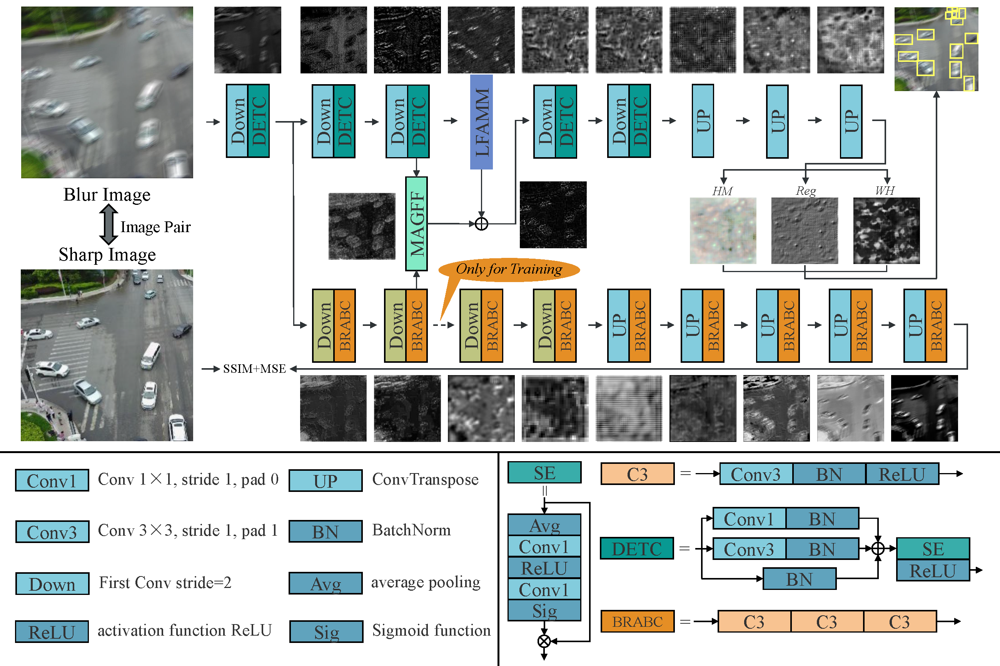
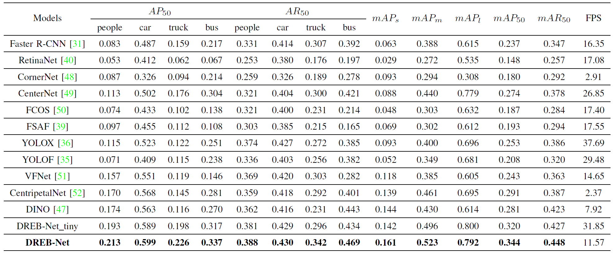

# DREB-Net

Implementation of paper - DREB-Net: Dual-stream Restoration Embedding Blur-feature Fusion Network for High-mobility UAV Object Detection


<div align="center">
    <a href="./">
        
    </a>
</div>


## Performance 

Test Results on The Blurred VisDrone-2019-DET Dataset. 

<div align="center">
    <a href="./">
        
    </a>
</div>


## Usage

Installation： 
``` shell
conda create -n DREBNet python=3.7.5
conda activate DREBNet
pip install -r requirements.txt
```

Data preparation:
``` shell
python tools/gen_motion_blur/blur_image.py
```

train:
``` shell
sh bash/train.sh
```

evaluation:
``` shell
sh bash/evaluation.sh
```

inference:
``` shell
sh bash/inference.sh
```

</details>


## Demo

<div align="center">
    <a href="./">
        
    </a>
</div>

